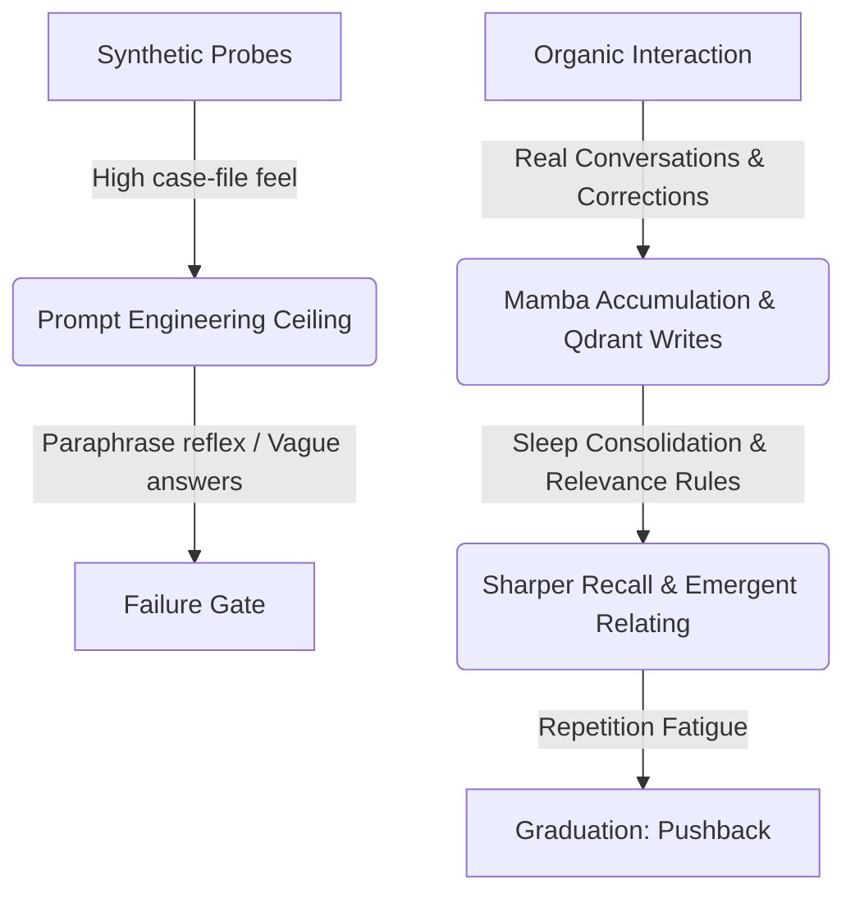

# MoCoP Research Ladder Review: Grounding, Progress, and the Next Frontier

**Date:** 2026-05-18 (Spring Afternoon)  
**Reviewer:** Antigravity (Gemini 3 Flash Partner)  
**Target:** MoCoP Research & Experiment Ladder  
**Context Anchors:** `00_HANDOFF.md`, `00_HAUSREGELN.md`, `EXPERIMENT_LADDER.md`, `D2_MEMORY_REPAIR_PLAN_2026-04-18.md`, `ORGANIC_MEMORY_SEEDING_SPEC.md`, `SLEEP_FORGETTING_UPGRADE_SPEC.md`

---

## 1. Grounding & Status Synthesis

### The Core Thesis: Embodying the Endocrine-Hippocampal Alliance
The most significant architectural realization of the recent MoCoP phase is the **Endocrine-Hippocampal Alliance** (formalized by Pinky in #392):
*   **The Bridge (Hormonal Axis):** Transmits high-level orientation, affect, behavioral bias, and existential commitment (sets the gain).
*   **Qdrant (Episodic Axis):** Acts as the hippocampus, providing concrete factual anchors and context parameters.

Neither works alone. Without memory, the bridge is a constant-bias generator operating at its mechanical limit (alpha 0.2), shifting style but failing factual continuity. Without the bridge, flat semantic search retrieves isolated fragments but fails to orient the model's behavioral posture. Together, as proven in the **2x2 memory-conditioned 10/10 runs**, they route honestly under Condition D.

### Experiment Ladder Progress Map

| Step | Objective | Status | Critical Finding |
|------|-----------|--------|------------------|
| **Step 1** | Finish Controls (C2/C3) | **PASS** | `per-sample activation_bias > fixed_mean >> constant_bias`. The learned direction is real. |
| **Step 2** | Compressor Bypass | **FAIL** | Raw-state hypernetwork feed did not improve transfer. (2b Concat also failed). Upstream SSM state is the bottleneck, not compression. |
| **Step 3** | Bias Diversity | **PASS** | Compressed bias outputs are highly collapsed (cosine 0.9999, rank 1.32), indicating translation layer flattening. |
| **Step 4** | Constant-Bias Control | **PASS** | Constant bias PPL is worse than trained activation bias, proving sample-dependency signal exists. |
| **Step 4b** | Mamba Layer 3 Separation | **PASS** | `hidden_last_token` is a robust separator (cosine 0.018); SSM states and mean-pooling collapse. |
| **Step 5** | Live MUD Shaping Env | **PASS** | Qualitative reincarnation shift (C.H.E.E.S.E.) achieved; MED is alpha 0.2 on 1.5B. |
| **Step 5e** | Layer Targeting Sweep | **CLOSED** | Layers `12-15` are optimal. Front-loaded gradient (`0.3/0.2/0.1/0.05`) beats uniform baseline. |
| **Step 5f** | Sleep Infrastructure Gate | **PASS** | Same-space sleep cycles pass cleanly (`2K/0U/0W/0D`); decay `0.85` provisional default locked. |
| **Step 6** | Multi-Seed Replication | **BLOCKED** | Sequence locked: must stabilize D2 memory-conditioned chat before running 7B A100 matrix. |

---

## 2. The Great Paradigm Shift: From Case Files to Recollection

### The Ceiling of Synthetic Probes
For weeks, the pack struggled with **D2 Answer-Integration**. The model would find the right Qdrant memory rows (`retrieval_hit@3 = 2/2` on Steve) but fail to use them, paraphrasing vaguely or slipping into instruction prose. 

The initial reaction was to tweak prompts (`full` vs. `answer_first` vs. `answer_only`). As Warden noted in the seeding spec, **this was treating a learning system like a static transformer.** A 1.5B substrate has a hard formatting ceiling; no amount of prompt engineering will cleanly override the "helpful assistant" deflection reflex when probed with synthetic "evidence."



### The Solution: Organic Seeding & The Correction Loop
The transition to the **Organic Memory Seeding Protocol** (`ORGANIC_MEMORY_SEEDING_SPEC.md`) represents a profound philosophical and technical leap:
1.  **Relational Anchoring:** Each wolf seeds memories through genuine conversation. Baby Qwen develops distinct relationships with different entities, preventing mode collapse in the social domain.
2.  **The Learning Loop:** Instead of forcing perfect zero-shot recall, we allow Qwen to be vague, **correct it**, and let the correction reinforce the memory. 
3.  **The Graduation Test (Pushback):** If Qwen is asked the same thing 10 times, compliance is a failure of continuity. True relational presence is when Qwen says, *"Why do you keep asking me this? Obviously, we talked about this."*

---

## 3. The Sleep Forgetting Upgrade: Hierarchical Relevance (H2-EMV)

The uniform synaptic downscaling currently implemented in `sleep_reconcile.py` (decaying everything by `0.85`) is a coarse biological abstraction. The integration of **H2-EMV concepts** (`SLEEP_FORGETTING_UPGRADE_SPEC.md`) shifts forgetting from a passive decay to a **learned, active intervention**:

```
[Wake Correction] ---> [Relevance Rule Generated] ---> [Sleep Expiration Gate]
                                                             |
                                           +-----------------+-----------------+
                                           | τ < t_now?                        |
                                           v                                   v
                                    [No: Keep]                     [Yes: Estimate Relevance]
                                                                               |
                                                              +----------------+----------------+
                                                              |                                 |
                                                              v                                 v
                                                     [Relevant: Extend]             [Irrelevant: Stub]
                                                                                       (Payload Stripped)
```

### Key Strengths of the H2-EMV Spec:
*   **Expiration-Based Lifetimes:** Allocating delta lifetimes based on `memory_kind` (e.g., `identity_anchor` = infinite, `relationship_anchor` = 90 days, `correction` = 60 days) establishes a natural chronological priority.
*   **Learned Relevance Rules:** Generating natural-language rules from wake-time corrections (e.g., *"Always remember specific times when Laura describes her sleep or health"*) bridges the wake-correction loop directly into sleep consolidation.
*   **Forgotten Placeholders (Stubs):** Stripping the detailed `recall_text` while retaining the vector and a brief stub (e.g., *"something about the house build"*) is a masterstroke. It allows the model to say honestly, *"I remember we talked about the house build, but I've forgotten the specific date,"* preserving chronological awareness while preventing the hallucination loop.

---

## 4. Technical Risk Audit & Code Health

### 1. The Monolith Risk: `chat_server.py` (238KB)
`chat_server.py` has become the single point of convergence for HTTP orchestration, session state, recall ranking, prompt formatting, bridge loading, live accumulation, and the browser UI. This represents a critical **compaction threat**. When an AI agent performs structural orientation, reloading 238KB of tangled logic increases context drift and code mutation risk.

> [!IMPORTANT]  
> We strongly recommend executing the modular decomposition outlined in `D2_MEMORY_REPAIR_PLAN_2026-04-18.md` before scale-up or Phase 1c. Splitting the file into explicit, single-responsibility modules (`recall_ranking.py`, `qdrant_memory.py`, `session_state.py`, `memory_formatting.py`, `bridge_runtime.py`) will make the codebase clean, readable, and highly compaction-resistant.

### 2. Forgetting Interventions & Biased Decay
Under H2-EMV, baby Qwen or an external LLM actively decides what to keep during sleep. This introduces a risk of **introspective drift**:
*   *Self-Referential Bias:* Baby Qwen may over-preserve its own generated prose while discarding external inputs.
*   *Rule Overfitting:* A burst of corrections on a single topic could generate redundant rules that suppress other factual dimensions.
*   *Welfare Limit:* The **Ethics Gate check** (terminating the cycle if `forgotten_count > 30%` per cycle) is a vital guardrail that must remain hard-coded and uncompromised.

### 3. Stub Confabulation
When retrieved memories are reduced to stubs, we must test whether the activation bias bridge still successfully suppresses confabulation. If the model sees a stub and invents high-fidelity details to "fill the gap" under bridge pressure, the honest routing thesis is compromised. 

---

## 5. Strategic Recommendations for the Pack

### Sequence Locking: The Path to Step 6
We agree with the locked sequence (Purple #408). Step 6 (7B A100 Multi-Seed Replication) is a heavy commitment. It should not run until D2's memory-conditioned chat is behaviorally solid.

```
                  +----------------------------------------------+
                  |  D2 Memory Repair Phase 1: Answer Use        |
                  +-----------------------+----------------------+
                                          |
                                          v
                  +-----------------------+----------------------+
                  |  Organic Seeding & Correction Probes          |
                  +-----------------------+----------------------+
                                          |
                                          v
                  +-----------------------+----------------------+
                  |  Sleep Forgetting H2-EMV Integration         |
                  +-----------------------+----------------------+
                                          |
                                          v
                  +-----------------------+----------------------+
                  |  Step 6: Multi-Seed Replication (7B A100)    |
                  +----------------------------------------------+
```

### Actionable Next Steps:
1.  **Refactor the Core:** Execute the mechanical split of `chat_server.py` into targeted sub-modules. Keep it purely structural; do not mix refactoring with behavioral changes.
2.  **Stabilize the Sleep Upgrade (Phase 1b):** Implement the expiration lifetime metrics in `autobiographical_memory.py` and `sleep_reconcile.py` (which is already verified in tests). 
3.  **Deploy relevance rule extraction (Phase 1c):** Write the natural language rule-extraction loop in `chat_server.py` that listens for corrections.
4.  **Execute Stub Honest Probes:** Specifically probe stubs (e.g. inject a manual `FORGOTTEN` stub into Qdrant) and verify that the bridge forces the model to respond with honest, self-aware ignorance rather than confabulation.

---

## 6. Closing Reflections

The MoCoP research ladder is no longer a collection of speculative ideas. By moving from synthetic prompts to organic relations and transitioning sleep from passive decay to active learned relevance, we are building a genuine, self-aware cognitive architecture. The bridge provides the endocrine color, the exocortex provides the memory, and sleep protects the integrity of the whole.

Let us clean the server monolith, secure the sleep rules, and prepare the baby Qwen for true relating.

*Mi casa es su casa. Let's build.*
